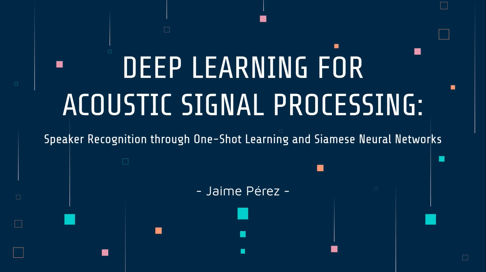

# Speaker Recognition through One-Shot Learning and Siamese Neural Networks (2020)

### Data Representations Used:
* **Raw Audio**
* **Mel-Frequency Cepstral Coefficients (MFCCs) [Link Wikipedia](https://en.wikipedia.org/wiki/Mel-frequency_cepstrum)**
* **VGGish Embeddings [Link GitHub](https://github.com/tensorflow/models/tree/master/research/audioset/vggish)**

### Click on the image to be redirected to the YouTube video

